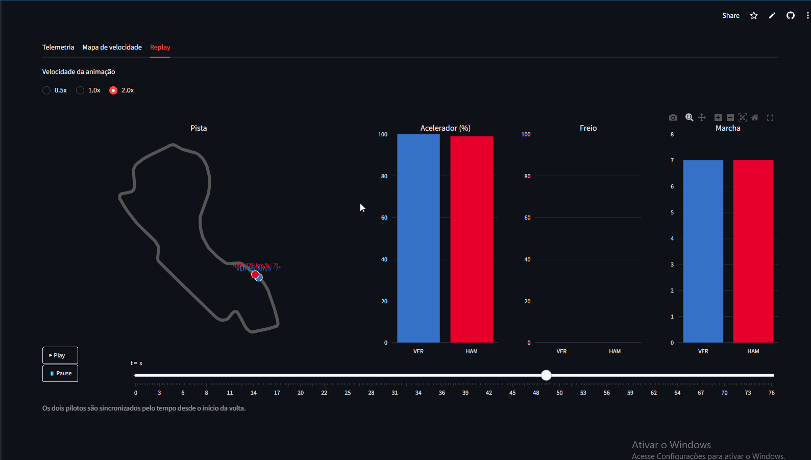
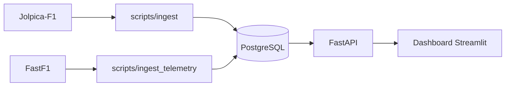

# F1 Analytics API


API em FastAPI que serve resultados históricos de F1 e **compara a volta mais rápida de dois pilotos**
(velocidade, acelerador, freio, marcha e delta de tempo), com um dashboard em Streamlit que inclui
um replay animado da volta.

**Demo:** [_link do dashboard_](https://f1analytics-auortuffm7nhtjzdynm9c3.streamlit.app/) · **API (Swagger):** [_link_/docs](https://f1-analytics-f4qa.onrender.com/docs)
> A demo roda em plano gratuito: se estiver parada, a primeira visita pode levar cerca de 1 minuto para acordar.



## Arquitetura



A API **nunca chama fontes externas durante uma requisição**: os dados são tratados uma vez
pelos scripts de ingestão e servidos do banco.

## Stack
Python · FastAPI · SQLAlchemy 2 · PostgreSQL · Pydantic · Streamlit · Plotly · pytest · Docker · GitHub Actions

## Endpoints
| Rota | Descrição |
|---|---|
| `GET /races?season=2023` | corridas (paginado) |
| `GET /races/{season}/{round}` | resultados de uma corrida |
| `GET /drivers?q=verstappen` | busca de pilotos |
| `GET /drivers/{id}/results` | histórico do piloto |
| `GET /compare?season=2023&round=1&d1=VER&d2=PER` | comparação de voltas |
| `GET /compare/available` | pilotos com telemetria |

## Rodando localmente
```bash
docker compose up -d db
python -m venv venv && source venv/bin/activate     # Windows: venv\Scripts\activate
pip install -r requirements-ingest.txt
python -m scripts.ingest --from 2025 --to 2026
python -m scripts.ingest_telemetry --season 2025 --round 1
uvicorn app.main:app --reload                        # http://localhost:8000/docs

pip install -r dashboard/requirements.txt
streamlit run dashboard/app.py                       # http://localhost:8501
```
Ou a API + banco juntos: `docker compose up --build`.

## Testes
```bash
pip install -r requirements-dev.txt
pytest
```
Os testes de API usam SQLite em memória (sem Postgres) e cobrem rotas, erros 404/400/422,
ordenação de resultados e o cálculo do delta.

## Decisões técnicas
- **Banco como intermediário:** FastF1 e Jolpica são lentos e têm limite de uso. Ingerir uma vez e servir do banco deixa a API rápida e a demo no ar mesmo com a fonte fora.
- **Telemetria reamostrada em 300 pontos por distância:** alinha as duas voltas e mantém o JSON leve. Os pontos entre amostras são interpolados.
- **Delta aproximado:** compara os pilotos pela posição relativa na volta; cada um faz uma linha diferente, então é uma aproximação boa para visualização, não uma medição exata.
- **Ingestão idempotente:** pode rodar de novo sem duplicar dados.
- **Dashboard só consome a API**, nunca o banco nem o FastF1.
- **Dependências separadas** (API, ingestão, dashboard): a imagem Docker da API fica leve.

## Limitações e próximos passos
- Sem autenticação nem cache (API pública de leitura).
- Previsão de pódio (`/predict`) ainda não implementada.
- Estratégia de pneus (stints) ainda não exibida.

## Deploy (plano gratuito)
1. **Banco:** crie um projeto no [Neon](https://neon.com) e copie a connection string.
2. **Dados:** `DATABASE_URL="<string do Neon>" python -m scripts.ingest --from 2023 --to 2023`, depois `ingest_telemetry` para algumas rodadas (o plano gratuito tem 0,5 GB).
3. **API:** no [Render](https://render.com), crie um Web Service a partir do repositório (ambiente Docker, plano Free) com a variável `DATABASE_URL`.
4. **Dashboard:** no Streamlit Community Cloud, aponte para `dashboard/app.py` e defina `API_URL` com a URL da API do Render.

Confira os limites atuais de cada plano nas páginas oficiais antes de publicar.
